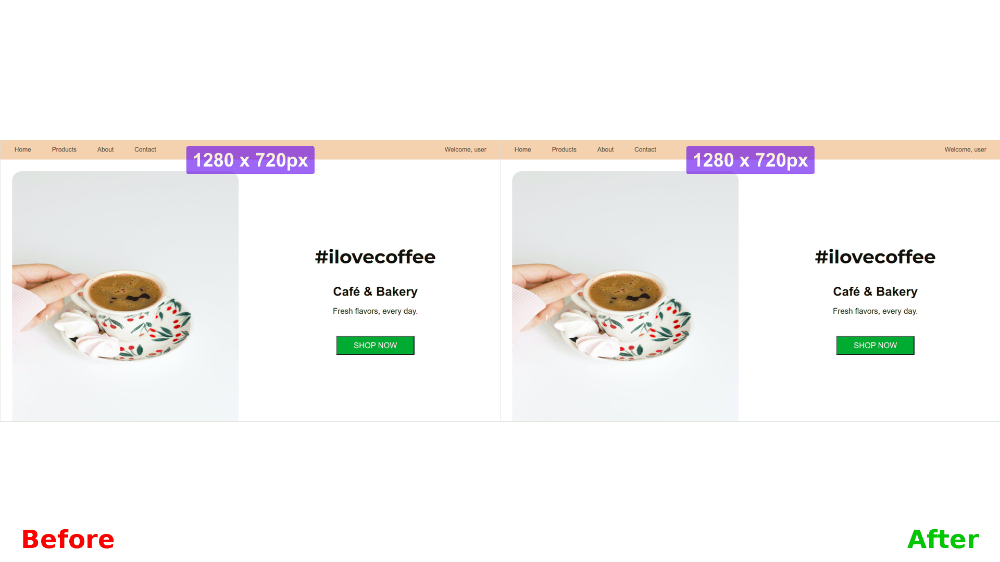

# ui-scaler

Your best ally for easily building responsive web applications:

Build your web interface in one single resolution, and the package will scale the UI for all desktop resolutions

## Usage

There are two usage methods:

#### NPM / YARN

```
npm i ui-scaler
```

Then in your app entry point:

```JavaScript
// main.ts
import scaleUI from 'ui-scaler'

...

// last line
scaleUI()
```

#### Script tag

```HTML
<head>
  <script src="https://cdn.jsdelivr.net/npm/ui-scaler@1.0.0/dist/browser-bundle.min.js"></script>
</head>
```

## Demo
The script will make sure your app proportions and relative sizes are the same across all different desktop resolutions:



## How it's done

#### [A script](https://github.com/arthursb2016/ui-scaler/blob/master/src/script.ts) will be added to your app, which:

1. Has 8kb
2. Runs once the document is ready
3. Optionally, adds style transformations logic, converting pixels values to rem values
4. Adds a window resize event listener that updates the HTML tag font-size based on the screen resolution and browser font-size

Notice your app HTML font-size to be different in each screen resolution

All properties with rem values will respond and adjust accordingly

## Options

You can pass an argument to the `scaleUI(boolean | TransformPixelsOptions)` method, instructing the script to attempt converting pixels values to rem:

#### Default transform options example

The script will try to convert all document pixel styles to the respective rem definition

```JavaScript
// main.ts
import scaleUI from 'ui-scaler'

...

scaleUI(true)
```

#### Custom transform options example

The script will try to convert all document pixel styles to the respective rem definition, excluding border-radius attributes, and elements with `myCustomId` id or `my-custom-class` class

```JavaScript
// main.ts
import scaleUI from 'ui-scaler'

...

scaleUI({
  excludeAttributes: ['border-radius'],
  excludeSelectors: ['#myCustomId', '.my-custom-class']
})
```

#### Bypassing transformations

You can also add the `ignore-ui-scaler` class to any HTML element so the script transformations do not have effect. Example:

```HTML
<style>
.width-300 {
  width: 300px;
}
/* Auto-generated class definition - done by the transformation script */
.width-300:not(.ignore-ui-scaler) {
  width: 18.75rem;
}
</style>

<div class="width-300 ignore-ui-scaler">
  My width will remain in pixels!
</div>
```
